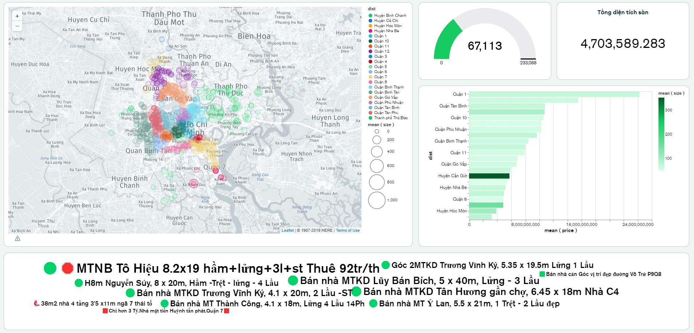

# Realtime-trending-coin-volumes-Binance
Processing data of 200k houses in HCMC, raw data after scraping from nhatot.vn is put into HDFS, then transform with Spark and load into redshift data warehouse. BI tool for data using Superset.

## Technology
visualization: Superset
backend: Python, Hadoop, Spark, S3, Redshift.

## Usage

```

```


## Demo
https://house.vietdoo.engineer/

