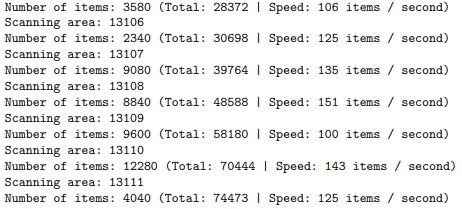

# Statistics of real estate data in HCMC
Processing data of 200k houses in HCMC, raw data after scraping from nhatot.vn is put into HDFS, then transform with Spark and load into redshift data warehouse. BI tool for data using Superset.

## Technology
visualization: Superset
backend: Python, Hadoop, Spark, S3, Redshift.

## Usage

##### 1. Crawler module.
A class written to crawl houses in the last 2 months on nhatot.vn. Using headers and random request times.
```
from crawler.module import Crawler
```

```
bot = Crawler()
data = bot.run()
```

###### Result:


##### 2. Put raw data to Data Lake Hadoop HDFS.
Turn on HDFS
```
ssh localhost
start-all.sh
```

Put local files to HDFS
```
hdfs dfs -mkdir /lake
hdfs dfs -copyFromLocal /home/jayson/raw310323.json /lake/
```


##### 3. Transform with Spark and Load to S3.
Combine multi json files in hdfs.
```
python3 spark/combine.py
```
Filter data and load to s3.
```
python3 spark/process.py
```

##### 4. Put data to Redshift data warehouse.
```
Run query in file redshift/run.sql
```

##### 5. Connect with superset.

##### 6. (Alternative) Mongo Visualization.
Because of the limitation in deploying superset to production, it takes a lot of resources, so you can refer to the data visualized on mongo atlas.
## Demo (mongo)
https://house.vietdoo.engineer/

